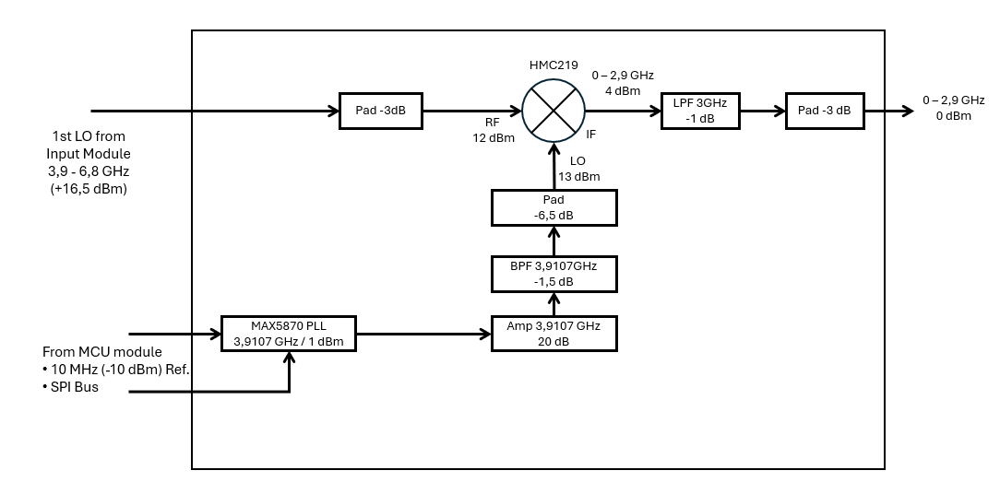

# Base‑Band Tracking Generator Module  
**RF Output:** 0–2.9 GHz  
**Mixer Core:** HMC219  
**TG LO:** MAX2870 at fixed 3.9107 GHz  
**Reference:** 10 MHz from spectrum analyzer  
**Sweep Source:** Analyzer 1st LO

---

## Overview

The Base‑Band module generates a tracking‑synchronous RF output from 0–2.9 GHz.  
It is used for:

- IF chains up to S‑band  
- Wideband filters  
- General‑purpose stimulus-response measurments in the 0–2.9 GHz range

The module uses:

- The analyzer’s 1st LO as the swept input  
- A fixed MAX2870 PLL at 3.9107 GHz  
- An HMC219 mixer  
- A 3 GHz low‑pass filter and output pad

The mixer’s difference product reconstructs the analyzer RF at base‑band.

---

## Frequency plan

### Analyzer RF  
`RF_SA = 0–2.9 GHz`

### Analyzer 1st LO  
`LO_SA = RF_SA + IF_1`  with `IF_1 = 3.9107 GHz`

So:  
`LO_SA = 3.9107–6.8107 GHz`

### TG LO (MAX2870)  
The MAX2870 is programmed once at power‑up:  
`LO_TG = 3.9107 GHz`

### Mixer relationship  
HMC219 ports:

- RF port: analyzer 1st LO  
- LO port: fixed 3.9107 GHz  
- IF port: TG output (0–2.9 GHz)

Mixer output:  
`IF_TG = LO_SA – LO_TG = RF_SA`

Thus the TG output equals the analyzer RF.

---

## Block diagram

---

## Power budget (nominal)

| Stage                          | Frequency         | ΔdB     | Level    |
|--------------------------------|------------------:|--------:|---------:|
| **Analyzer LO → Mixer RF**     |                   |         |          |
| SA 1st LO                      | 3.9–6.8 GHz       |   0 dB  | +16.5 dBm|
| Isolator                       | 3.9–6.8 GHz       |  -0.5 dB| +16.0 dBm|
| RF pad                         | 3.9–6.8 GHz       |  –1 dB  | +15 dBm|
| Misc. losses (routing, etc.)   | 3.9–6.8 GHz       |  –1 dB  | +14 dBm  |
| LO at HMC219 RF port           | 3.9–6.8 GHz       |   0 dB  | +13 dBm  |
|                                |                   |         |          |
| **TG LO → Mixer LO**           |                   |         |          |
| MAX2870 output                 | 3.9107 GHz        |   0 dB  |  +1 dBm  |
| LO amplifier                   | 3.9107 GHz        | +20 dB  | +21 dBm  |
| BPF                            | 3.9107 GHz        |  –1.5 dB| +19.5 dBm|
| LO pad                         | 3.9107 GHz        |  –6.5 dB| +13 dBm  |
| LO at HMC219 LO‑pin            | 3.9107 GHz        |   0 dB  | +13 dBm  |
|                                |                   |         |          |
| **Mixer IF → TG output**       |                   |         |          |
| HMC219 IF‑output               | 0–3 GHz           |   0 dB  |  ~+4 dBm |
| LPF 3 GHz                      | 0–3 GHz           |  –1 dB  |  +3 dBm  |
| Output pad                     | 0–3 GHz           |  –3 dB  |   0 dBm  |
| TG output (SMA)                | 0–3 GHz           |   0 dB  |   0 dBm  |

---

## Control architecture

- MAX2870 uses the analyzer’s 10 MHz reference  
- SPI control from Raspberry Pi Pico (MCU)
- LO is fixed; no sweep‑depedent tuning necessary 
- MCU handles LO enable/mute and lock‑detect

---

## Mechanical / layout notes

- 3.9107 GHz LO chain short and shielded  
- Good isolation between high‑level LO and the 0–2.9 GHz output  
- Fine‑tune pads for correct levels at:  
  - SA 1st LO input  
  - MAX2870 LO chain  
  - HMC219 RF/LO/IF ports  
  - Final output  
- 3 GHz LPF ensures suppression of LO feedthrough and mixer images

---