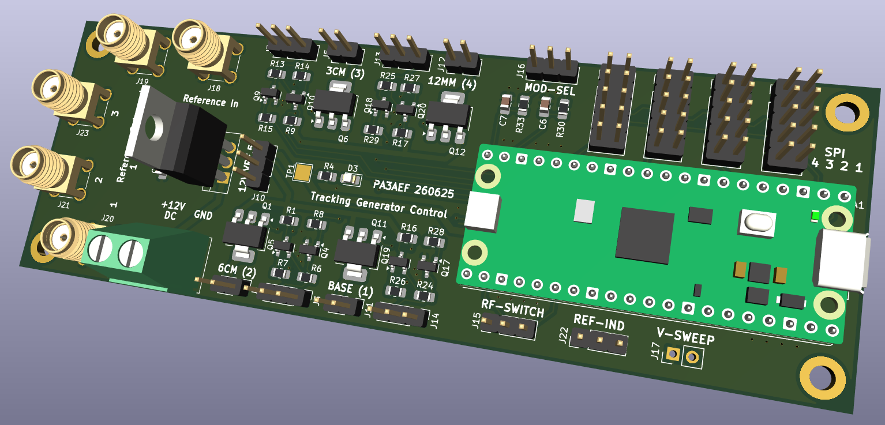

# Control Module — MCU and 10 MHz Reference Buffer (Hardware)

Compact hardware overview for the Control Module: power sequencing, protection, MCU host interfaces, and the low‑noise 10 MHz reference buffering and 1:4 distribution. Detailed hardware-level descriptions for the **10 MHz reference** and **MCU** are in separate documents (`docs/10MHz_reference.md`, `docs/mcu-hardware.md`). Firmware is covered elsewhere.

---

## Purpose

- Buffer and distribute an external **10 MHz reference** to **4 isolated outputs**  
- Provide MCU-host hardware: power, programming, debug, and physical control interfaces  
- Protect and condition reference and power inputs (ESD, TVS, reverse polarity)  
- Present SPI/UART/USB headers and status indicators for system integration

---

## Block Diagram

10 MHz Ref In → Input Protection → Low‑noise Buffer → 1:4 Splitter/Switch → Output Buffers → **4 × SMA REF OUT**  
Power In → Sequencing & Regulators → MCU + Peripherals  
MCU headers: SPI, UART, VRef, Switch, RF-Modules

---

## Hardware Interfaces

- **Reference Input**
  - **SMA** connector with input protection and level detect
  - DC blocking and optional AC coupling upstream of buffer
- **Reference Outputs**
  - **4 × SMA** buffered outputs, individually enabled
  - Target nominal level: **0 dBm** per output (see `docs/10MHz_reference.md`)
- **Control / Comms**
  - **SPI** header (MOSI, MISO, SCLK, CS, GND, Vcc) for downstream PLLs
  - **UART / USB** hardware interface for firmware connectivity
- **Power**
  - External DC input with reverse‑polarity protection
  - Onboard regulators with power‑good signals and sequencing
- **Indicators**
  - Power, module-select and lock detect fault LEDs at PCB headers

---

## Design Notes (Hardware Only)

- **Phase noise:** buffer chosen to add minimal phase noise; layout keeps RF ground continuous under RF chain.  
- **Isolation:** per‑output buffering prevents cross‑talk; outputs terminated and DC‑blocked.  
- **Protection:** input ESD, TVS, and surge protection on REF IN and power rails.  
- **Mechanical:** SMA connectors on PCB edge; keep digital switching components physically separated from RF path.  
- **EMC:** ferrite beads, common‑mode chokes, and local decoupling to reduce digital noise coupling into 10 MHz path.  
- **Test points:** RF amplitude, buffer bias, and power‑good nets exposed for bench verification.

---

## Connector / Pin Summary

- **REF IN:** SMA (10 MHz)  
- **REF OUT 1–4:** SMA buffered outputs  
- **SPI:** 6‑pin header (MOSI, MISO, SCLK, CS, GND, Vcc)  
- **UART/USB:** Micro‑USB or TTL UART header  
- **POWER:** Screw terminal or header;
- **Band Selection:** 3-pin header
- **LO Switch:** 3-pin header
- **RF Modules:** 3-pin and 2-pin headers 

---

## Control Module
 

---

## Documentation

Hardware detail references:  
- **`10MHz_reference.md`** — full schematic, BOM, and RF measurements  
- **`mcu-hardware.md`** — MCU pinout, power sequencing, and debug connectors  
- **`control-module`** — mechanical drawings and test fixtures

---